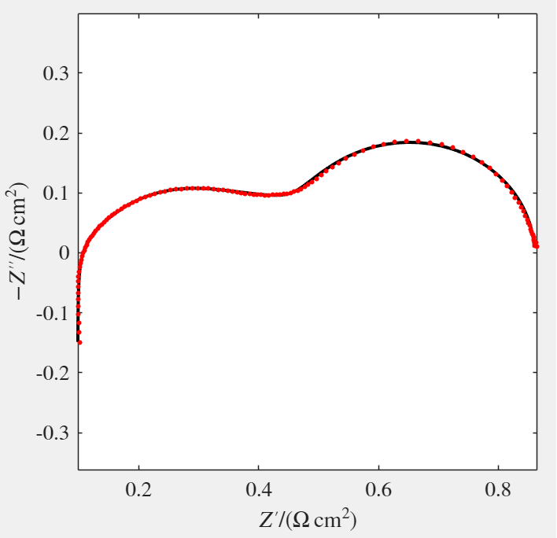
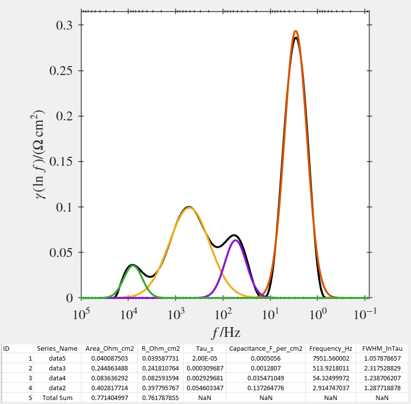
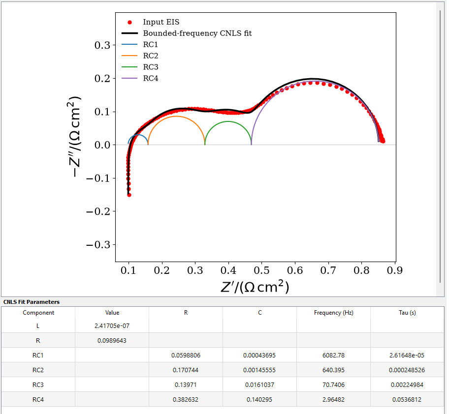

# DRT Peak Analysis

> [!NOTE]
> **As of August 28, 2026, the MATLAB version is no longer being updated** to allow development efforts to focus on the Python version.  
> Please download the latest Python release with new features and improvements from [here](https://github.com/MFakouri/pyDRT-Peak-Analysis-).
> 
An integrated MATLAB GUI for EIS data import, Distribution of Relaxation Times (DRT) analysis, peak deconvolution, and automated extraction of peak parameters.
This repository provides an extended and modified version of pyDRTtools in which data conversion, DRT analysis, peak analysis, and parameter export are integrated into a single GUI.

  

  Nyquist plot.

  

  DRT peaks.

  

  RCs Fitting (in Python version).

## Main Features

- Direct import of EIS data exported from different instruments, including BioLogic (.mpr), Zahner (.ism), Gamry (.dta), Scribner/ZView/ZPlot (.z), MATLAB (.mat), and generic text/data files (.txt, .csv, .dat).
- Automatic conversion and standardization of imported EIS files for use in pyDRTtools.
- Optional active-area correction for impedance data reported in Ω.
- Direct use of data already normalized in Ω·cm² without additional area correction.
- DRT calculation and visualization within the same GUI.
- Peak deconvolution directly from the DRT curve.
- Automated extraction of the following parameters for each DRT peak:
  - Polarization resistance (R)
  - Capacitance
  - Relaxation time (τ)
  - Peak frequency
  - FWHM (Full Width at Half Maximum)
- Automatic export of the peak parameters to a CSV file.
- Automatic saving of the resulting figure.
- CNLS fitting using DRT-derived peak parameters as initial values for the RC elements, with visualization of the measured and fitted Nyquist plots together with the individual RC semicircle contributions (in Python version).
- Standalone Windows executable available; no Python or MATLAB installation or additional configuration required.
    Download exe file [here](https://github.com/MFakouri/pyDRT-Peak-Analysis-/tree/master/Windows-Executable)

## Original DRTtools

This software is based on and extends the original **DRTtools** toolbox developed by the [Ciucci Lab](https://github.com/ciuccislab/DRTtools).

## Contact and Citation

Developed and modified by:

**Masood Fakouri Hasanabadi**  
Email: [fakourih@ualberta.ca](mailto:fakourih@ualberta.ca)

If you use this software in your research, please cite this GitHub repository using the **“Cite this repository”** option available on GitHub:

https://github.com/MFakouri/DRT-Peak-Analysis-

Please cite the software in any publications or presentations in which it is used.
Users should also cite the original DRTtools publication referenced in [Ciucci Lab repository] (https://github.com/ciuccislab/DRTtools).
